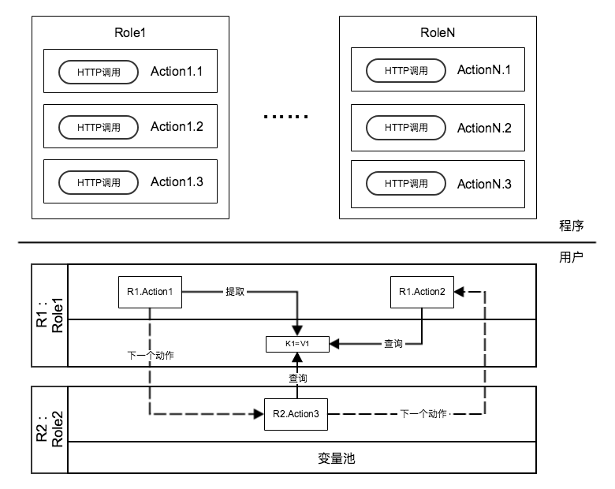

# testflow
testflow的基本理念是将(http)调用封装成一个个python函数，并按照功能和模块将这些python函数划分为不同的角色，然后用户可以创建相同或不同角色的多个对象，并组合这些对象的动作构成一条调用链。

为了使数据可以在调用链上流转，每个角色对象都包含了一个变量池，这个变量池可以保存用户从当前角色对象的动作结果中提取的值，同时也可供其他角色对象查询当前变量池下的值。



元数据(装饰器)介绍
-------------
想要应用装饰器函数，需要在 \_\_init__.py 文件导出目标模块。 

### role(角色)
该装饰器用于自动注册当前角色到系统的角色列表。  
MUST: 注册角色的代码必须放在模块的开头。  
NOTE: 被装饰函数的函数名称不做强制要求。  

### action(行为)
该装饰器用于自动注册当前动作到系统的动作列表。 

JSON返回值扁平化
-------------
将JSON返回值扁平化有利于值的提取和展示，JSON扁平化是指将复杂的对象转换为MAP(水平)结构。举个例子： 
```
{"a":{"b":{"c":"d","e":[{"f":{"h":"i"}},"g"],"j":6}}}
```
上面的对象在未格式化的时候很难一眼看出某个key的提取路径，而扁平化后则清晰展示了每个key的值和提取路径。 
```
$.a={}
$.a.b={}
$.a.b.c=d
$.a.b.j=6
$.a.b.e=[]
$.a.b.e[0]={}
$.a.b.e[0].f={}
$.a.b.e[0].f.h=i
$.a.b.e[1]=g
```

